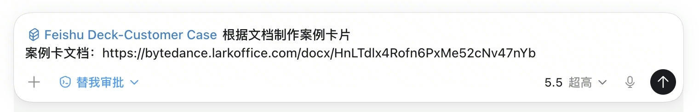

# Feishu Deck-Customer Case

**Feishu Deck-Customer Case｜10分钟制作客户案例一页纸**

基于 CSM 文档、客户成功材料和案例素材，先梳理可汇报故事，再生成飞书风格客户案例卡片。

## 适用场景

售前 / CSM / 销售团队，将客户最佳实践转成一页纸案例。

## 核心能力

- 先梳理"可汇报故事"，提炼背景痛点、解决方案、前后对比、量化价值和关键证据。
- 案例卡片参照 Before & After 逻辑，清晰呈现对比及方案价值。
- 自动判断图片证据展示方式，支持图片滑动查看、点击放大、完整图展示。

## 安装

该技能基于 feishu-deck-h5 衍生，需先安装并配合基础 Deck 技能使用。

基础技能仓库：

[https://github.com/FuQiang/feishu-deck-h5](https://github.com/FuQiang/feishu-deck-h5)

安装本技能：

```bash
python ~/.codex/skills/.system/skill-installer/scripts/install-skill-from-github.py \
  --url https://github.com/caiminhong0314/feishu-deck-customer-case/tree/main/feishu-deck-customer-case
```

安装后重启 Codex 以加载技能。

## 技能分支

当前公开仓库仅发布 `feishu-deck-customer-case`：证据型案例卡片，基于文档素材、截图证据和 Before & After 逻辑生成一页纸案例。

原型型案例演示技能仍在内部打磨中，暂不公开发布。

## 如何使用

1. 提供最佳实践文档。
2. 先确认 AI 生成的故事方向，再生成 HTML 案例卡片。
3. 如图片选择不准，直接指定必须展示的图片重新调整。
4. 如果案例内容较多、图片素材较多，或需要讲清多个业务场景，可以直接告诉 AI 做成两页案例卡片。



## 注意事项

- 需先安装 feishu-deck-h5 技能。
- 案例制作仍需要制作人对业务场景、故事主线和证明重点有清晰判断，不能完全依赖 AI 做重点选择和内容展示。
- 需要具备文档阅读权限和图片下载权限。
- AI 第一版图片选择不一定完全准确，需结合对客讲解逻辑确认关键素材。
